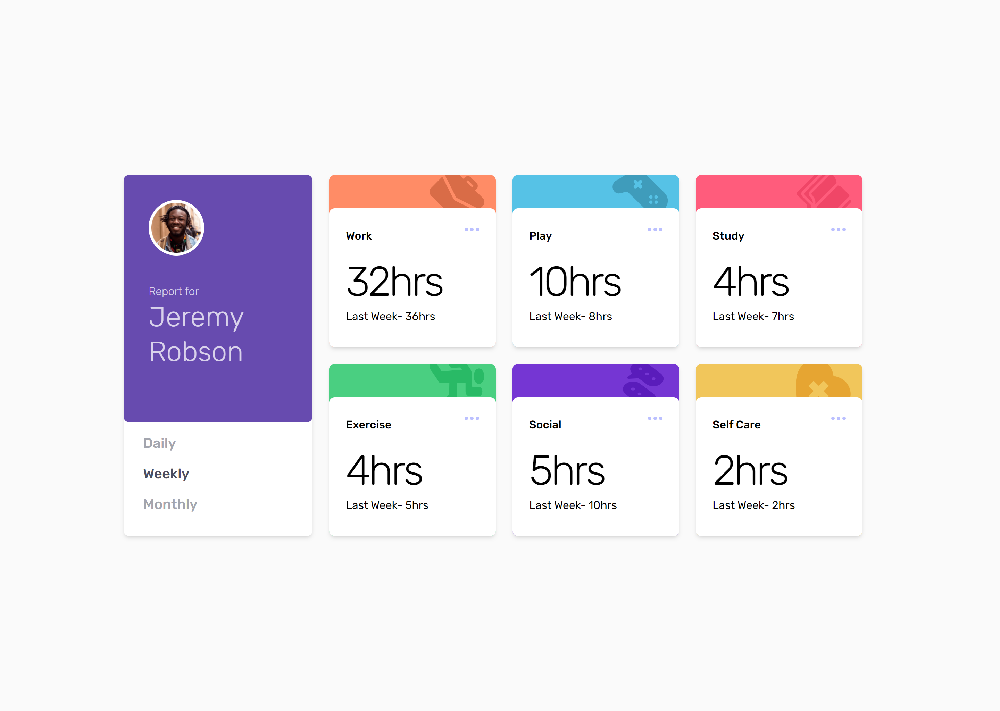

# hikmahy-tailwind-color-customization

This project was designed by [Frontend Mentor](https://www.frontendmentor.io/challenges/time-tracking-dashboard-UIQ7167Jw).

## Table of contents

- [Overview](#overview)
  - [The challenge](#the-challenge)
  - [Screenshot](#screenshot)
- [My process](#my-process)
  - [Built with](#built-with)
  - [Steps](#steps)
  - [What I learned](#what-i-learned)
  - [Useful resources](#useful-resources)
- [Author](#author)


## Overview

## The challenge

Users should be able to:

- View the optimal layout for the site depending on their device's screen size
- See hover states for all interactive elements on the page
- Customize the project the way they want to 


### Screenshot



This is the screenshot of my solution


## My process

### Built with

- Semantic HTML5 markup
- [Tailwindcss](https://tailwindcss.com) - CSS framework
- Flexbox
- CSS Grid
- Mobile-first workflow
- [React](https://reactjs.org/) - JS library
- [Google fonts](https://fonts.google.com/)

### Steps
- Install react: 
```js
 npx create-react-app [APP NAME]
 ```
- Install tailwind and its dependencies:
```js
npm install -D tailwindcss postcss autoprefixer
```
- Generate tailwind's configuration file: 
```js
npx tailwindcss init -p
```
- Add font link into html file: 
```html
    <link rel="preconnect" href="https://fonts.googleapis.com" />
    <link rel="preconnect" href="https://fonts.gstatic.com" crossorigin />
    <link
      href="https://fonts.googleapis.com/css2?family=Rubik:wght@300;400;500&display=swap"
      rel="stylesheet"
    />
```
-  Add all paths of your templates inside the content of your tailwind.config.js
```json
content: [
    "./src/**/*.{js,jsx,ts,tsx}",
  ], 
```
- Clear out index.css and add tailwind's directives into the file:
```css
@tailwind base;
@tailwind components;
@tailwind utilities;
```
- At this point, the tailwind is ready to be used. Just run ```npm start``` and the build process of the tailwind begins.

- For customization, go to tailwind.config.js. In the theme property, create colors and fontFamily properties containing all the customized style you have in mind. For this project:
```js
module.exports = {
    [...]
  theme: {
    extend: {},
    colors : {
      'violet': '#674baf',
      'red': '#ff5c7c',
      'orange': '#ff8c66', 
      'yellow': '#f1c65b',
      'blue': '#56c2e6',
      'purple': '#7536d3',
      'green': '#4acf81',   
      'light-gray': '#f2f2f2',
      'very-light-gray': '#fafafa',
      'grayish-blue': '#a3a5ae',
      'very-dark-blue': '#4c4e61',
      'transparent-white':'#ffffffbf', 
      'transparent': 'transparent',
      'white': '#ffffff',
      'black': '#000000'
    },
    fontFamily : {
      'rubik': ['Rubik', 'sans-serif']
    }
  }
```
-  To adjust a style without removing all other classes of that style, simply configured into extend and not in the base theme property: 
```js
theme: {
    extend: {
      height: {
        '50': '12.5rem',
        '62' : '15.5rem'
      },
      width:{
        '68': '17rem'
      },
      maxWidth: {
        'xl': '33rem',
        '4xl': "50rem"
      },
      fontSize:{
        '4xl' : '2.5rem'
      },
    }
}
```

- Run ```npm start``` and type a class you want to use into your project.

### What I learned
In this project, I learnt how to map through mutliple arrays at once. In my Cards.jsx, I had two array states and I extracted data from the provided json file. While mapping through the json, I used the index of the json data to map through the states.

```jsx
    {datas.map((data, index)=>{
        const color =  colors[index]
        const icon = icons[index]

        return(
        <>
            <CardItem key={index} data={data} color={color} icon={icon} />
        </>
        )
    })}
```

### Useful resources

- [Stack Overflow](https://stackoverflow.com) - This helped me alot whenever I felt stuck. Just google your problem and click any of the stackoverflow link. It's very useful.
- [Frontend Mentor](https://www.frontendmentor.io) - This project was provided by Frontend Mentor. Frontend Mentor challenges help you improve your coding skills by building realistic projects.


## Author

- Website - [Hikmah Yousuph](https://hikmah-yousuph.vercel.app/)
- Frontend Mentor - [@Hikmahx](https://www.frontendmentor.io/profile/Hikmahx)
- Email - [hikmayousuph@gmail.com](hikmayousuph@gmail.com)